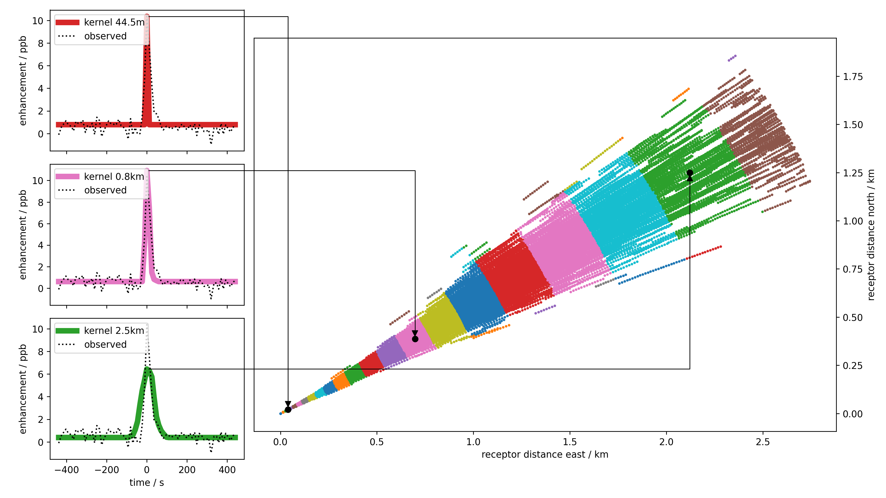

# Transfer-Kernel Ranging (TKR)

Reference implementation for **Transfer-Kernel Ranging (TKR)**, a top-down method to
locate and quantify point-source methane emissions from a time series of ground-based
column observations, using a Lagrangian Particle Dispersion Model (LPDM) and linear
time-invariant (LTI) system theory.

> F. Klappenbach, J. Chen, M. Oliveira Makowski, A. Luther, R. C. Cohen, J. E. Franklin,
> S. Wofsy, T. Jones: *"Novel method to locate and quantify point-source methane
> emissions using time series of ground-based column observations"*, EGUsphere, 2026.
> https://doi.org/10.5194/egusphere-2026-204 (in review)

The method was developed under the working title **"Local Source Projection" (LSP)**;
the released method/paper name is **Transfer-Kernel Ranging (TKR)**. All code, file, and
variable names in this repository use `TKR` / `tkr_*`.

<p align="center">
  
</p>

*Figure 1: Backward particle trajectories of one altitude shown from the receptor point (bottom left) traveling 
backward in time in ENE direction. These particles are separated into sections as shown above. Each section has 
own transport kernel, three examples shown in the left panels. The further the particles move from the
recepotr point, the broader the kernel gets. TKR derives an optimal estimate for the upwind distance comparing the
observed enhancements with the derived transport kernel.*

---

## What's in this repository

| File | Purpose |
|---|---|
| `TKR_full_pipeline.ipynb` | Single notebook: Part 1 runs the full TKR pipeline (peak detection → trajectory loading → upwind segmentation → transport-kernel fit → emission-strength inversion) for every available peak; Part 2 reproduces Figures 1–6 of the paper. |
| `tkr_functions.py` | All non-trivial logic (observation loading, geometry, trajectory handling, segmentation, kernel fitting, I/O, KMZ export). The notebook is mostly a thin wrapper around this module. |
| `config.json` | Run configuration — paths and method parameters (see below). |
| `figures/` | Output figures land here when the notebook is run (`Figure1.png`, `Figure2.png`, ...). The versions shown in this README/the paper are also checked in here for reference. |
|`demo_data_allpeaks/`| Incomplete dataset of thrajectories (size Limitation by GitHub). Full data can be downloaded here: **https://doi.org/10.5281/zenodo.21913882** |

The full method derivation, all equations, and the physical interpretation of every
quantity below are in the paper (Sect. 2, Appendices A–H) — this README documents the
*software*, not the method itself.

---

## Data: not included in this repository

This repository ships **with limited processing data**. The accompanying dataset (backward-trajectory
ensembles for every analysed peak, plus the aggregated density/site metadata and the raw
EM27/SUN PROFFAST 2.4/GGG2020 retrieval bundle) is included — the full per-particle trajectory data
alone is on the order of a few GB per peak and **~8 GB in total** for the case study in
the paper, which is impractical to version in Git, but can be downloaded here: **https://doi.org/10.5281/zenodo.21913882**

### Expected folder layout

Download the dataset (see [Hosting the dataset](#hosting-the-dataset-recommendations)
below) and unpack it so that the paths in `config.json` resolve, e.g.:

```
repo-root/
├── TKR_full_pipeline.ipynb
├── tkr_functions.py
├── config.json
└── demo_data/
    ├── df_dens.parquet
    ├── ma_avk_CH4_2020.json
    ├── em27-retrieval-bundle-ma-proffast-2_4-GGG2020-20161102-20161104.parquet
    └── traj/
        ├── 20161103-1626-SF_LAB-total-column/
        │   ├── about.json
        │   └── traj/
        │       ├── particle_stilt.0.parquet
        │       ├── particle_stilt.1.parquet
        │       └── ...  (one file per release height, config: release_heights)
        ├── 20161103-1638-SF_LAB-total-column/
        │   └── ...
        └── ...  (one folder per analysed peak, named <date>-<HHMM>-<site_id>-total-column)
```

`config.json`'s `data_dir` / `traj_dir` / `df_dens_path` /
`observations_path` / `averaging_kernel_path` point at this layout by default; adjust
them if you place the data elsewhere.

Receptor location and altitude are plain values in `config.json` (`receptor_lat`,
`receptor_lon`, `receptor_alt_asl_m`) rather than a separate file — see the note on
`site_params.pkl` below for why that file isn't part of this repository's data flow.

---

## Running the pipeline

*download* remaining data under **https://doi.org/10.5281/zenodo.21913882** and store it in the ./demo_data_allpeaks/traj

```bash
pip install numpy pandas scipy matplotlib pvlib simplekml jupyter
jupyter notebook TKR_full_pipeline.ipynb
```


`simplekml` is only needed for the Figure 6 (Google Earth) export cell at the end;
everything else only needs `numpy`, `pandas`, `scipy`, `matplotlib`, and `pvlib`.

Part 1 (data generation) takes roughly 15–30 minutes for the full peak set on a laptop
(~130 s/peak); Part 2 (figures) is fast once Part 1's results are cached
(`save_results`/`load_results` in `tkr_functions.py` pickle everything to
`config.json`'s `output_dir`, so Part 2 can be re-run independently after the first pass).

---

## `config.json` reference

| Key | Meaning |
|---|---|
| `campaign_name` | Free-text label for the measurement campaign (San Francisco Bay Area campaign, paper Sect. 2.1). Not used in any path or computation — informational only. |
| `date` | Local calendar date of the analysed observations, `YYYYMMDD`. Matched against the *local* date inside `read_obs_proffast_parquet` (see `utc_offset_hours` below), not the UTC date. |
| `site_dw` | Short site key, used e.g. as a naming component in some input filenames (`ma_avk_CH4_2020.json`). Historically also the lookup key into `site_params.pkl` (see the note under [Data dictionary](#data-dictionary) below on why that file is no longer part of this pipeline). |
| `site_id` | Site identifier used in the exported trajectory folder names (`<date>-<HHMM>-<site_id>-total-column/`) and in the results-cache filename. |
| `receptor_lat`, `receptor_lon` | Receptor (instrument) coordinates in decimal degrees — the coordinate origin for all upwind-distance/bearing calculations. |
| `receptor_alt_asl_m` | Receptor (instrument) altitude above sea level, in meters. Used together with each trajectory release point's altitude-above-ground (`alt`, itself AGL) to get the absolute altitude for the pressure calculation feeding the averaging-kernel lookup. |
| `data_dir` | Root folder for all input data (see [folder layout](#expected-folder-layout) above). |
| `traj_dir` | Folder containing one subfolder per analysed peak with that peak's exported STILT trajectories. |
| `df_dens_path` | Path to `df_dens.parquet` — aggregated air-density/altitude metadata, see [below](#df_denspaquet). |
| `observations_path` | Path to the EM27/SUN retrieval-bundle parquet (total-column observations). |
| `peak_data_path` | Reserved for a pre-computed peak table; the current notebook recomputes peaks from `observations_path` directly rather than reading this file, so it can usually be left as-is. |
| `averaging_kernel_path` | Path to the instrument's column averaging-kernel JSON, see [below](#averaging-kernel-json). |
| `output_dir` | Where `save_results`/`load_results` (Part 1 → Part 2 handoff) write/read the pickled fit results. |
| `target_gas` | Target species, lowercase (`ch4`). Used to select the `X<GAS>` / `<GAS>` columns from the observation bundle. |
| `quantile` | Background quantile for the rolling-window enhancement calculation (paper Eq. B1; paper uses `0.1`, i.e. the 10th percentile). See Appendix B, Table B1 for the sensitivity to this choice. |
| `roll_time` | Width of the centered rolling background window, as a pandas offset string (paper uses `60min`). |
| `prominence` | Minimum peak prominence (in the same units as the enhancement, i.e. ppm) passed to `scipy.signal.find_peaks` for peak detection (paper Fig. 1). |
| `hi_res_time_resolution` | Time resolution (minutes) used to interpolate trajectories and histogram particle arrival times when building the transport kernel (paper Eq. 3). Default `1/30` min = 2 s. |
| `trajectory_cutoff_minutes` | Drop backward-trajectory points older than this (minutes, negative = further into the past) before segmentation — limits how far upwind the analysis looks. |
| `peak_window_minutes` | Width (minutes) of the observation window around each peak used for the Step 1/2 fits (paper Sect. 2.5–2.6). |
| `drf` | Fractional growth rate of the radial segmentation step size (paper Appendix E/F; exponentially increasing radial bins). |
| `dr` | Initial radial bin width in km. |
| `rad_max_km` | Maximum upwind radius (km) considered in the segmentation. |
| `max_radial_steps` | Hard cap on the number of radial bins. |
| `source_altitude_bins` | Number of altitude bins spanning `0` to `max_source_altitude_m`. |
| `max_source_altitude_m` | Maximum source altitude above ground (m) considered in the segmentation. |
| `max_peaks` | Reserved for limiting how many peaks Part 1 processes (e.g. for a quick test run); not read by the current notebook, which processes every peak with locally available trajectory data — set this in the notebook's `PEAK_OPTIONS` selection if you want to cap it manually. |
| `release_heights` | Number of receptor release-height points along the instrument's line of sight to load per peak (paper Sect. 2.3 / Appendix C). |
| `plot` | Reserved flag for enabling/disabling diagnostic plots in the lower-level functions; most plotting in the current notebook is unconditional (figures are generated explicitly cell-by-cell in Part 2) rather than gated on this flag. |
| `colormap_plots` | Default matplotlib colormap name for diagnostic plots. |

Two further keys are used by the notebook but are not (yet) part of the shipped
`config.json` — they're set with sensible defaults directly in the notebook's setup cell
and can be moved into `config.json` if you prefer:

| Key | Meaning |
|---|---|
| `obs_location_id` | Optional `location_id` filter passed to `read_obs_proffast_parquet`. A physical site can appear under more than one `location_id` label in the retrieval bundle (e.g. after a database migration) — check the unique values in your bundle before setting this. |
| `utc_offset_hours` | Local time-zone offset from UTC (e.g. `-7` for Pacific Daylight Time), used only to determine the local calendar-day boundary for `date` filtering — does not affect any timestamp actually stored or plotted. |

---

## Data dictionary

This section documents the structure of the three aggregated/auxiliary input files, so
the pipeline can be adapted to a different site, campaign, or instrument. It's derived
directly from how each field is *used* in `tkr_functions.py`; a few points noted as
"please confirm" below are inferred from usage rather than from an explicit schema and
are worth double-checking against the actual file before reuse.

### `df_dens.parquet`

One row per (peak time × altitude level), aggregated **once per peak** from the full
per-particle STILT output — i.e. much smaller than the raw trajectory parquet files
under `traj/`, and used only for (a) the averaging-kernel weighting and (b) building the
`minutes_grid` that observed peak times are snapped onto. It is **not** the same data as
`traj/*/traj/particle_stilt.*.parquet` (those are per-particle, per-timestep; `df_dens`
is per-peak, per-altitude-layer).

| Column | Used for | Notes |
|---|---|---|
| `minutes` | Building `minutes_grid = np.unique(df_dens.minutes)`, the discrete set of peak times for which trajectory data exists. | Minutes since local midnight UTC, matching the convention used for `peak_time` elsewhere in the pipeline. |
| `alt` | Release-height layer index/value (e.g. one of the `release_heights` release altitudes for a given peak), given above ground level (AGL). | Used both to compute `layer_thickness` (midpoint spacing between adjacent `alt` values) and downstream as a join key. Combined with `config.json`'s `receptor_alt_asl_m` to get the absolute altitude for the pressure/averaging-kernel lookup. |
| `recep` | Peak/receptor timestamp, formatted `YYYYMMDDHHMM` (parsed via `pd.to_datetime(..., format='%Y%m%d%H%M', utc=True)`). | Same timestamp convention as the trajectory `about.json`'s `receptor.dt` / the exported folder name `<date>-<HHMM>-...`. |
| `density` | Air density in the altitude layer, used to convert to a column amount: `layer_molec_m2 = density / m_air * layer_thickness / 1000`. | **Please confirm units** — the formula implies `density` is a mass density (kg/m³) divided by the molar mass of air (`28.97 g/mol`) to obtain a molar column density; the `/1000` suggests a g↔kg unit reconciliation on top of that. Cross-check against your STILT/HYSPLIT output's native density units before reusing this column for a different model configuration. |
| `numpar` | Number of particles per release point (should match `about.json`'s `particles_per_release_point` for the corresponding peak/release height). | Used to normalise the per-trajectory averaging-kernel weight. |
| `scf`, `scf_inf` | Weighting factors for the receptor points along the instrument's line of sight (LOS), by the number of molecules in each layer (paper Appendix C/D). `scf` weights every layer up to the topmost one, with the topmost layer weighted symmetrically to the layer below it; `scf_inf` instead assigns the topmost layer the weight of the *entire remaining atmosphere above it*. | Not used by the current pipeline/notebook: this case study's analysis is confined to the lowest layers (near-surface sources), where the choice between `scf` and `scf_inf` makes no practical difference. Relevant mainly for tall-stack or well-mixed-column source scenarios reaching higher into the profile. |

Derived in the notebook from these columns (not stored in the file itself): `layer_thickness`,
`utc`, `sza` (solar zenith angle via `pvlib`), `ak` (averaging-kernel value), `layer_molec_m2`,
`dens_layer_weight`, `full_weight_per_trajectory`.

### Receptor metadata: `site_params.pkl` is not used by this pipeline

Some earlier/internal versions of this codebase read per-site receptor metadata from a
pickled `site_params.pkl`, keyed by the short site name (`site_params[site_dw]`, e.g.
`site_params['ma']`). Its full set of fields is
`{los_params, long_0, lati_0, color, site_dist, zinst, obs_start, obs_end, foot_minutes}`,
but only `lati_0` / `long_0` (receptor coordinates) and, optionally, `zinst` (instrument
altitude above sea level) are relevant to this method — the rest (line-of-sight
parameters, plotting color, site distance, observation time bounds, footprint window
length) are bookkeeping for other parts of a larger internal pipeline and don't feed into
TKR itself.

To keep this repository self-contained, those three relevant values are given directly in
`config.json` instead (`receptor_lat`, `receptor_lon`, `receptor_alt_asl_m`) — there is no
`site_params.pkl` in the [data layout](#expected-folder-layout) above. If you're adapting
this pipeline and already have a `site_params.pkl`-style structure from other tooling,
just populate those three `config.json` fields from it (`lati_0`→`receptor_lat`,
`long_0`→`receptor_lon`, `zinst`→`receptor_alt_asl_m`) rather than reintroducing the pickle
as a dependency.

### Averaging-kernel JSON (`ma_avk_CH4_2020.json`)

The instrument's column averaging kernel A(SZA, pressure) (paper Appendix D), as a
JSON file with three keys:

| Key | Meaning |
|---|---|
| `szas` | 1D array of solar zenith angles (degrees) spanning the grid. |
| `pressures` | 1D array of pressures (hPa) spanning the grid. |
| `aks` | 2D array of averaging-kernel values, shape `(len(szas), len(pressures))`. |

Loaded via `load_ak()` into a `scipy.interpolate.RegularGridInterpolator`, so it can be
evaluated at arbitrary `(sza, pressure)` pairs with `ak((sza, pressure))`. To apply TKR
to a different instrument, regenerate this JSON from that instrument's own averaging
kernel (typically available from the retrieval software, e.g. PROFFAST) on a
representative SZA/pressure grid.

### Trajectory export (`traj/<date>-<HHMM>-<site_id>-total-column/`)

One folder per analysed peak (paper Sect. 2.3), containing:

- **`about.json`** — run metadata:
  - `receptor.location.{lat,lon}` — site coordinates.
  - `receptor.dt` — measurement timestamp.
  - `receptor.sun_elevation` — solar elevation at measurement time (→ SZA = 90° − this).
  - `receptor.release_points[]` — one entry per release height, each with `lat`, `lon`,
    `alt_agl`, `alt_asl`, `pressure`, `density_weight`.
  - `config.jobs[0].release.release_heights` — list of release altitudes (m AGL).
  - `config.jobs[0].release.particles_per_release_point` — particle count per release.
- **`traj/particle_stilt.<i>.parquet`** — one file per release height `i`, with one row
  per (particle × timestep) of the backward trajectory: `indx` (particle ID), `time`
  (minutes, negative = backward), `lati`, `long`, `zagl`, `zasl`, `dens` (air density
  along the trajectory), `foot` (STILT surface-influence footprint).

These trajectories were generated using RETRO (Oliveira Makowski et. al., 2026) running
HYSPLIT (Stein et al. 2015) using the STILT transport mode (Lin et al., 2003;  Loughner
et al., 2021). See the paper's Sect. 2.3 for the trajectory configuration used in the case
study (500 particles/receptor, 1-minute steps, HRRRv1 meteorology).

### EM27/SUN Retrieval Bundle

The EM27/SUN data was retrieved using the EM27 Retrieval Pipeline (Makowski et al., 2026)
running Proffast 2.4 (Hase et al., 2025) using the ProffastPylot (Feld et al., 2024) under
the hood. It uses GGG2020 (Laughner et al., 2024) as an atmospheric prior.

---

## Citing

If you use this code, please cite the paper:

```bibtex
@article{klappenbach2026tkr,
  title   = {Novel method to locate and quantify point-source methane emissions
             using time series of ground-based column observations},
  author  = {Klappenbach, Friedrich and Chen, Jia and Oliveira Makowski, Moritz
             and Luther, Andreas and Cohen, Ronald C. and Franklin, Jonathan E.
             and Wofsy, Steven and Jones, Taylor},
  journal = {EGUsphere},
  year    = {2026},
  doi     = {10.5194/egusphere-2026-204}
}
```